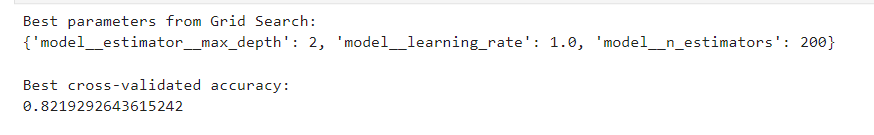

---

## Results Summary
- Ensemble models consistently outperformed single classifiers.
- **Extra Trees and Random Forest with SMOTE** achieved the best balance between accuracy and generalization.
- SMOTE significantly improved minority-class detection and F1 scores.
- Hyperparameter tuning further enhanced model stability and reduced overfitting.
- Cross-validation confirmed consistent performance across different data splits.

---

## Results

### Hyperparameter Tuning (Grid Search)

Grid Search was used to optimize AdaBoost hyperparameters, identifying the best configuration based on cross-validated accuracy. The optimal model achieved a strong balance between bias and variance.

---

## Model Performance After SMOTE (K-Fold Cross Validation)

After applying SMOTE, ensemble models showed improved cross-validation accuracy, reduced variance, and better minority-class detection.

---

## Model Performance Before SMOTE (K-Fold Cross Validation)

Before SMOTE, models exhibited higher apparent accuracy but significantly weaker F1 sco

---

### Randomized Search Cross-Validation Results

Randomized Search CV further evaluated multiple model configurations efficiently, confirming the superiority of ensemble methods when combined with imbalance-handling techniques.
---
