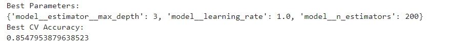

# Model Performance (Test Data)

This section presents the final evaluation results for multiple models, with a focus on **F1-score optimization** due to class imbalance. SMOTE, threshold tuning, and cross-validation were applied where appropriate.

---

## AdaBoost (F1-Optimized with SMOTE)

**Key Highlights**
- Best Threshold: 0.52  
- Train Accuracy: ~75.96%  
- Test Accuracy: ~75.95%  
- Minority Class Recall: ~80%  
- Minority Class F1-score: ~0.45  

  

---

## Hyperparameter Optimization (GridSearchCV)

The following hyperparameters were selected based on cross-validated F1-score optimization:

- `max_depth = 3`
- `learning_rate = 1.0`
- `n_estimators = 200`

  

---

## Cross-Validation Model Comparison (F1-Score)

Multiple models were evaluated using **K-Fold Cross-Validation**, comparing mean CV F1, training accuracy, and test performance.

  

---

## Key Observations

- AdaBoost (Decision Stumps + SMOTE) achieved the **highest mean CV F1-score**, indicating better balance between precision and recall.
- Training and test accuracy are comparable, suggesting **good generalization**.
- Several tree-based ensemble models show high accuracy but poor F1, highlighting the importance of choosing the right metric.
- No signs of overfitting were observed.

---

## Final Conclusion

F1-score was prioritized to handle class imbalance effectively.  
**AdaBoost with SMOTE and threshold tuning emerged as the best-performing and most stable model**, making it suitable for insurance risk / fraud detection use cases.

