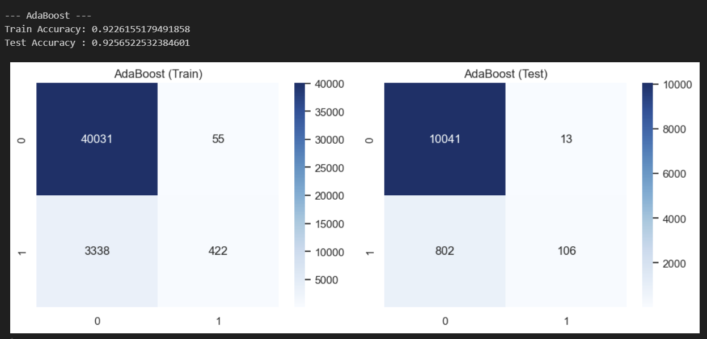
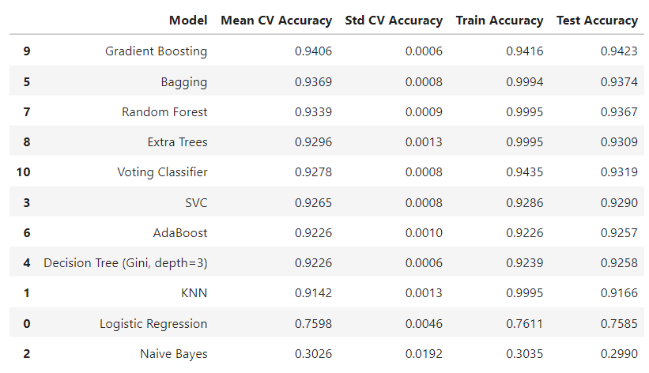
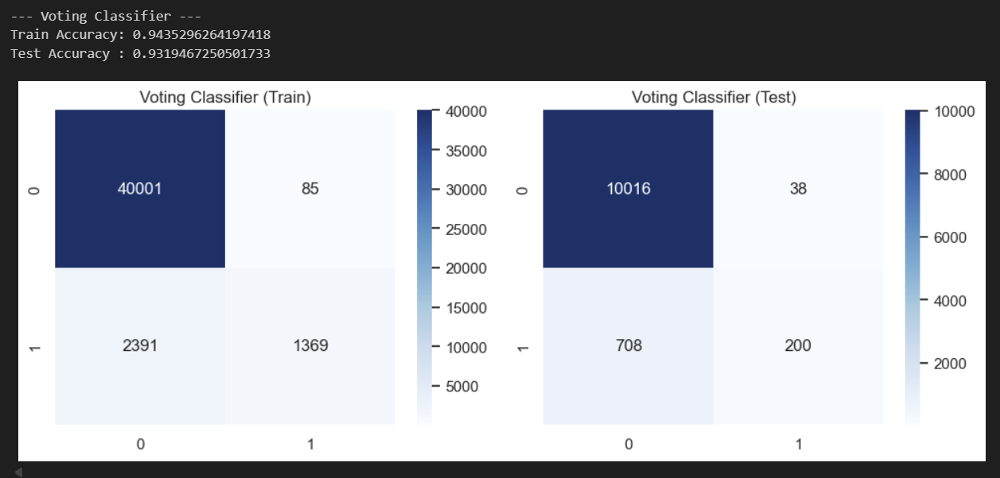

## Evaluation Metrics
Model performance was assessed using:

- Training Accuracy
- Test Accuracy
- Confusion Matrix
- Mean Cross-Validation Accuracy
- Standard Deviation of Cross-Validation Accuracy

These metrics help ensure that selected models perform well on unseen data and are not overfitting.

---

## Results Summary
- Ensemble models consistently outperformed individual classifiers.
- **Gradient Boosting and Bagging** achieved the highest cross-validation accuracy.
- **Voting Classifier** provided stable and balanced performance by combining multiple models.
- Cross-validation confirmed that ensemble approaches generalize better than standalone models.
- Simpler models such as Logistic Regression underperformed compared to tree-based ensembles.

---

## Results

### AdaBoost Classifier Performance

The AdaBoost classifier demonstrates strong generalization with closely matched train and test accuracy.  
Confusion matrices indicate effective majority-class prediction, with some challenges in minority-class recall.

---

### Model Comparison (Cross-Validation & Accuracy)

This comparison highlights the performance of multiple classifiers using mean cross-validation accuracy, standard deviation, and train–test accuracy.  
Ensemble methods such as Gradient Boosting, Bagging, and Random Forest outperform single models.

---

### Voting Classifier Performance

The Voting Classifier combines multiple base learners to improve robustness and stability.  
Results show balanced performance with improved generalization compared to individual models.
