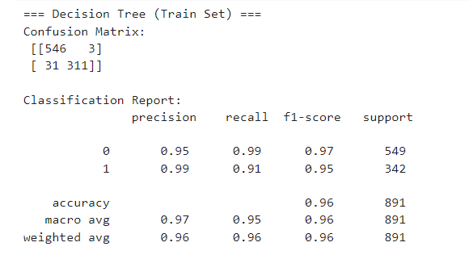
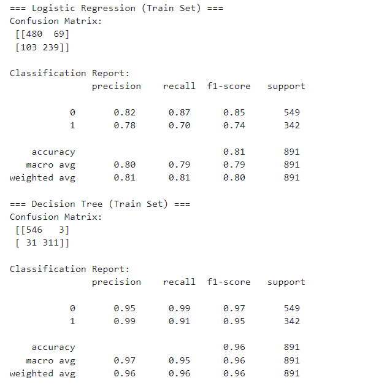

## Evaluation Metrics
Model performance was assessed using:

- Confusion Matrix
- Precision
- Recall
- F1 Score
- Accuracy

These metrics provide a detailed view of model performance beyond accuracy alone.

---

## Results Summary
- The Decision Tree classifier achieved very high training accuracy and strong F1 scores.
- Logistic Regression performed reasonably well but showed lower recall and F1 scores compared to the Decision Tree.
- Tree-based models captured non-linear relationships more effectively in this dataset.
- Evaluation metrics highlight the importance of using multiple performance measures for classification problems.

---

## Results

### Decision Tree – Training Performance

The Decision Tree classifier achieved high training accuracy, demonstrating strong class separation. The confusion matrix shows very low misclassification, particularly for the majority class.

---

### Logistic Regression vs Decision Tree (Training Set)

This comparison highlights the difference between a linear model (Logistic Regression) and a tree-based model (Decision Tree).  
While Logistic Regression provides reasonable performance, the Decision Tree achieves significantly higher precision, recall, and F1-score on the training data.
