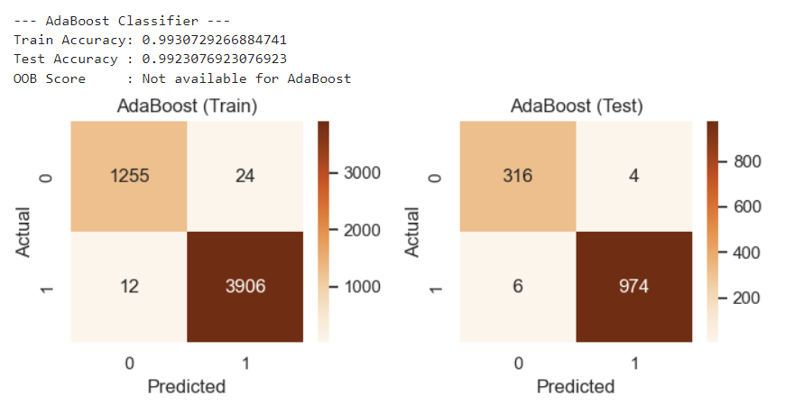
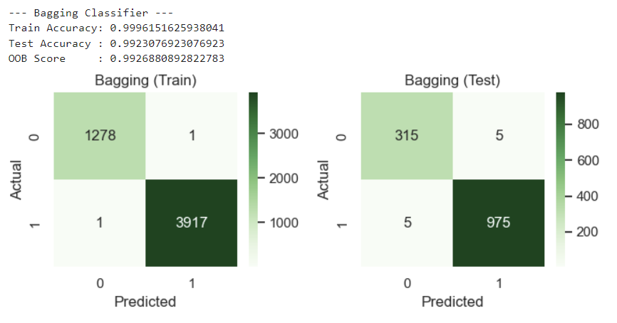
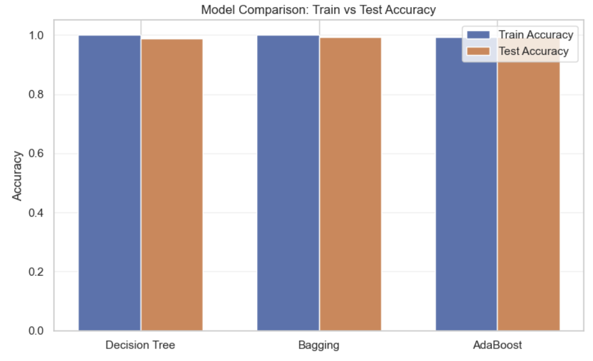
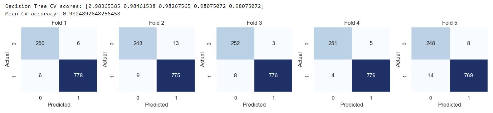

## Results
All evaluation plots and visualizations are available in the **Results/** directory, including:

- Confusion matrices for training and test datasets
- Ensemble model performance comparisons
- K-Fold cross-validation results

These results highlight the effectiveness of ensemble methods in reducing overfitting and improving generalization.

---

## Results

### AdaBoost Classifier

### Bagging Classifier

### Model Comparison (Train vs Test Accuracy)

### K-Fold Cross Validation

