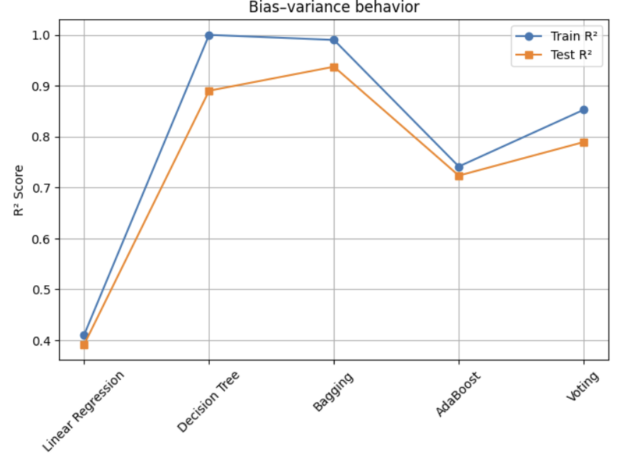
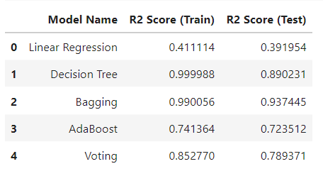
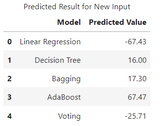

## Results Summary
- Linear Regression underperformed due to high bias.
- Decision Tree showed overfitting with near-perfect training R².
- Bagging achieved the best generalization with the highest test R² score.
- AdaBoost progressively reduced training and testing error with increasing estimators.
- Voting Regressor provided stable and balanced performance.

---

## Results

### Bias–Variance Behavior Across Models

This plot illustrates the bias–variance tradeoff for different regression models.  
Bagging achieves the best balance with high test R² and minimal overfitting, while Linear Regression underfits and Decision Tree shows signs of overfitting.

---

### R² Score Comparison (Train vs Test)

This table compares training and testing R² scores across models.  
Ensemble methods outperform single models, with Bagging achieving the highest test R² score and best generalization.

---

### Prediction for New Input Data

Predicted bike rental counts for a new input using different regression models.  
Results highlight how model choice significantly impacts numerical predictions.

---

### Training vs Testing Error Reduction in AdaBoost

This plot shows how AdaBoost reduces both training and testing error as the number of trees increases, demonstrating improved learning and controlled overfitting.
