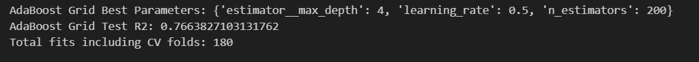
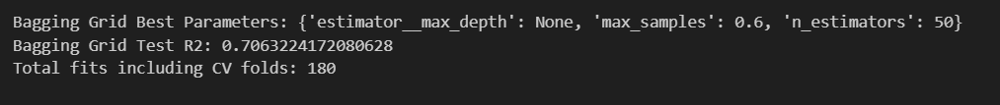
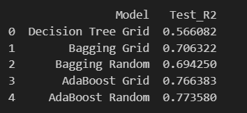

## Results Summary
- Untuned decision trees showed signs of overfitting.
- Bagging improved stability and generalization over single trees.
- AdaBoost achieved the highest test R² after tuning.
- Randomized Search was more efficient while achieving comparable or better results than Grid Search.
- Hyperparameter interaction plots revealed optimal depth and sampling regions.

---

## Results

### AdaBoost Hyperparameter Tuning (Grid Search)

Grid Search was applied to tune AdaBoost hyperparameters.  
The optimized model achieved improved test R² by balancing learning rate, estimator depth, and number of estimators.

---

### Bagging Hyperparameter Tuning (Grid Search)

Bagging performance improved by tuning the number of estimators and sample fraction.  
The results show better generalization compared to an untuned decision tree.

---

### Decision Tree Hyperparameter Interaction

This 3D visualization illustrates how decision tree depth and minimum samples interact to influence model performance (R²).  
It highlights regions where overfitting and underfitting occur.

---

### Model Tuning Comparison

This comparison summarizes test R² scores across different tuning strategies.  
AdaBoost with randomized search achieved the best overall performance among all models.
